# 📦 ARCHIVE - Task Documentation Command

> **Memory Bank System v0.8** - Command-based workflow for Cursor 2.1+

## Purpose

ARCHIVE creates the final comprehensive documentation for a completed task, consolidating all artifacts, updating the Memory Bank, and preparing the system for the next task.

## Workflow

```mermaid
graph TD
    Start["🚀 ARCHIVE COMMAND"] --> VerifyReflect{"✅ Reflection<br>Complete?"}
    
    VerifyReflect -->|"No"| ReturnReflect["⛔ Return to<br>/reflect"]
    VerifyReflect -->|"Yes"| GatherDocs["📚 Gather All<br>Documentation"]
    
    GatherDocs --> CreateArchive["📦 Create Archive<br>Document"]
    
    CreateArchive --> UpdateTasks["📝 Mark Task<br>COMPLETE in tasks.md"]
    UpdateTasks --> UpdateProgress["📈 Update<br>progress.md"]
    UpdateProgress --> ResetContext["🔄 Reset<br>activeContext.md"]
    
    ResetContext --> ArchiveCreative["📁 Archive Creative<br>Documents"]
    ArchiveCreative --> Complete["✅ Task Fully<br>Archived"]
    
    Complete --> SuggestNext["💡 Suggest /van<br>for Next Task"]
```



## Instructions

When this command is invoked:

### Step 1: Acknowledge and Load Rules

Respond with "**OK ARCHIVE**" and load archive rules:

```
Load: .cursor/rules/isolation_rules/visual-maps/archive-mode-map.mdc
```

Load level-specific archive rules:

**Level 1-2:**
```
Load: .cursor/rules/isolation_rules/Level2/archive-basic.mdc
```

**Level 3:**
```
Load: .cursor/rules/isolation_rules/Level3/archive-intermediate.mdc
```

**Level 4:**
```
Load: .cursor/rules/isolation_rules/Level4/archive-comprehensive.mdc
```

### Step 2: Verify Reflection Complete

Check that `memory-bank/reflection/reflection-[task-id].md` exists.

If missing: "Reflection not complete. Use `/reflect` first."

### Step 3: Gather Documentation

Collect all task-related documents:
- `memory-bank/tasks.md` - Task details and checklist
- `memory-bank/progress.md` - Implementation progress
- `memory-bank/creative/creative-*.md` - Design decisions (if any)
- `memory-bank/reflection/reflection-[task-id].md` - Reflection

### Step 4: Create Archive Document

Create `memory-bank/archive/archive-[task-id].md` with consolidated documentation.

### Step 5: Update Memory Bank

1. **tasks.md**: Mark task as COMPLETE and clear for next task
2. **progress.md**: Add archive reference
3. **activeContext.md**: Reset for next task

### Step 6: Archive Creative Documents

Move or reference creative phase documents in the archive.

### Step 7: Suggest Next Task

"Task archived successfully. Use `/van` to start a new task."

## Archive Templates

### Level 1-2: Basic Archive

```markdown
# Task Archive: [Task Name]

**ID**: [task-id]
**Date Completed**: [Date]
**Complexity**: Level [1-2]

## Summary
[Brief description of what was accomplished]

## Changes Made
- `path/to/file1.ext`: [Change description]
- `path/to/file2.ext`: [Change description]

## Testing
- [Test 1]: ✅ Passed
- [Test 2]: ✅ Passed

## Key Learnings
- [Learning from reflection]

## Related Documents
- Reflection: `reflection/reflection-[task-id].md`
```

### Level 3: Intermediate Archive

```markdown
# Task Archive: [Task Name]

**ID**: [task-id]
**Date Completed**: [Date]
**Complexity**: Level 3
**Duration**: [Total time]

## Executive Summary
[Overview of the task and its outcomes]

## Objectives
| Objective | Status |
|-----------|--------|
| [Objective 1] | ✅ Complete |
| [Objective 2] | ✅ Complete |

## Implementation Details

### Components Modified
| Component | Changes | Impact |
|-----------|---------|--------|
| [Component] | [Changes] | [Impact] |

### New Components Created
- `path/to/new/file.ext`: [Purpose]

## Design Decisions
[Summary from creative phase, if applicable]

**Full Design Document**: `creative/creative-[component].md`

## Testing Summary
- Unit Tests: [X] passed
- Integration Tests: [Y] passed
- Manual Testing: ✅ Complete

## Lessons Learned
[Key points from reflection]

## Future Considerations
- [Consideration 1]
- [Consideration 2]

## Related Documents
- Creative: `creative/creative-[component].md`
- Reflection: `reflection/reflection-[task-id].md`
```

### Level 4: Comprehensive Archive

```markdown
# Comprehensive Task Archive: [Task Name]

**ID**: [task-id]
**Date Started**: [Start Date]
**Date Completed**: [End Date]
**Complexity**: Level 4
**Total Duration**: [Time]

## Executive Summary
[High-level overview for stakeholders]

## Project Context
[Why this task was undertaken and its significance]

## Objectives and Outcomes

| Objective | Target | Actual | Status |
|-----------|--------|--------|--------|
| [Obj 1] | [Target] | [Result] | ✅ |
| [Obj 2] | [Target] | [Result] | ✅ |

## Architecture Overview

### System Design
[Diagram or description of architectural changes]

```mermaid
graph TD
    [Architecture diagram]
```

### Design Decisions
[Summary of key architectural decisions]

| Decision | Rationale | Outcome |
|----------|-----------|---------|
| [Decision] | [Why] | [Result] |

## Implementation Phases

### Phase 1: [Name]
- **Objective**: [What was achieved]
- **Components**: [List]
- **Duration**: [Time]
- **Challenges**: [Any issues]

### Phase 2: [Name]
[Same structure]

### Phase 3: [Name]
[Same structure]

## Technical Details

### Files Modified
| File | Changes | Lines Changed |
|------|---------|---------------|
| [File] | [Changes] | [+X/-Y] |

### Files Created
| File | Purpose |
|------|---------|
| [File] | [Purpose] |

### Dependencies Added
| Dependency | Version | Purpose |
|------------|---------|---------|
| [Package] | [Ver] | [Why] |

## Testing Documentation

### Test Coverage
- Unit Tests: [Coverage %]
- Integration Tests: [Coverage %]
- E2E Tests: [Coverage %]

### Test Results
| Test Suite | Passed | Failed | Skipped |
|------------|--------|--------|---------|
| Unit | [X] | [Y] | [Z] |
| Integration | [X] | [Y] | [Z] |

## Performance Metrics
[If applicable]

| Metric | Before | After | Improvement |
|--------|--------|-------|-------------|
| [Metric] | [Val] | [Val] | [%] |

## Lessons Learned

### Technical Insights
1. [Insight with detail]

### Process Insights
1. [Insight with detail]

### Recommendations
1. [Recommendation for future work]

## Maintenance Notes
[Important information for future maintenance]

## Related Documents
- Creative Documents:
  - `creative/creative-[component1].md`
  - `creative/creative-[component2].md`
- Reflection: `reflection/reflection-[task-id].md`
- External References: [Links if any]

## Sign-off
- Task completed and verified
- Documentation reviewed
- Memory Bank updated
```

## Output Format

```
✅ ARCHIVE COMPLETE

📋 Task: [Task description]
🧩 Complexity: Level [1-4]

📦 Archive Created: memory-bank/archive/archive-[task-id].md

📝 Memory Bank Updated:
  ✅ tasks.md - Marked complete
  ✅ progress.md - Archive reference added
  ✅ activeContext.md - Reset for next task

🎉 TASK FULLY COMPLETED

💡 Start next task with: /van
```

## Verification Checklist

```
✓ ARCHIVE VERIFICATION
- [ ] Reflection document exists?
- [ ] Archive document created with all sections?
- [ ] Archive placed in memory-bank/archive/?
- [ ] tasks.md marked COMPLETE?
- [ ] progress.md updated with archive reference?
- [ ] activeContext.md reset for next task?
- [ ] Creative documents archived (Level 3-4)?
```

## Memory Bank Reset

After archiving, the Memory Bank should be ready for the next task:

```
memory-bank/
├── tasks.md          ← Cleared, ready for new task
├── activeContext.md  ← Reset to default state
├── progress.md       ← Updated with archive reference
├── projectbrief.md   ← Unchanged (project-level)
├── productContext.md ← Unchanged (project-level)
├── systemPatterns.md ← May be updated with new patterns
├── techContext.md    ← May be updated with new tech
├── creative/         ← Task-specific docs moved to archive
├── reflection/       ← Contains all reflections
└── archive/          ← Contains all archives
    └── archive-[task-id].md ← New archive
```

