# 🎨 CREATIVE - Design Decisions Command

> **Memory Bank System v0.8** - Command-based workflow for Cursor 2.1+

## Purpose

CREATIVE facilitates structured design exploration for components flagged during planning. It implements Claude's "Think" tool methodology - generating multiple options, analyzing trade-offs, and documenting decisions before implementation.

## Workflow

```mermaid
graph TD
    Start["🚀 CREATIVE COMMAND"] --> ReadPlan["📚 Read tasks.md &<br>Implementation Plan"]
    
    ReadPlan --> Identify["🔍 Identify Flagged<br>Components"]
    
    Identify --> TypeCheck{"🎨 Design<br>Type?"}
    
    TypeCheck -->|"Architecture"| Arch["🏗️ ARCHITECTURE<br>DESIGN"]
    TypeCheck -->|"Algorithm"| Algo["⚙️ ALGORITHM<br>DESIGN"]
    TypeCheck -->|"UI/UX"| UI["🎨 UI/UX<br>DESIGN"]
    
    Arch & Algo & UI --> Process["Creative Process:<br>1. Define Requirements<br>2. Generate Options<br>3. Analyze Pros/Cons<br>4. Select & Justify<br>5. Document Guidelines"]
    
    Process --> SaveDecision["📝 Save to<br>memory-bank/creative/"]
    
    SaveDecision --> MoreComponents{"More<br>Components?"}
    MoreComponents -->|"Yes"| TypeCheck
    MoreComponents -->|"No"| UpdateTasks["📝 Update tasks.md"]
    
    UpdateTasks --> Complete["✅ → /implement"]
```



## Instructions

When this command is invoked:

### Step 1: Acknowledge and Load Rules

Respond with "**OK CREATIVE**" and load creative phase rules:

```
Load: .cursor/rules/isolation_rules/visual-maps/creative-mode-map.mdc
Load: .cursor/rules/isolation_rules/Core/creative-phase-enforcement.mdc
Load: .cursor/rules/isolation_rules/Core/creative-phase-metrics.mdc
```

### Step 2: Read Current Context

- `memory-bank/tasks.md` - Get plan with flagged components
- Previous creative documents if any exist

### Step 3: Load Design-Type Specific Rules

**For Architecture Design:**
```
Load: .cursor/rules/isolation_rules/Phases/CreativePhase/creative-phase-architecture.mdc
```

**For UI/UX Design:**
```
Load: .cursor/rules/isolation_rules/Phases/CreativePhase/creative-phase-uiux.mdc
```

### Step 4: Execute Creative Process

For each flagged component, follow this structured process:

#### 🎨🎨🎨 ENTERING CREATIVE PHASE

1. **Component Description**
   - What is this component?
   - What problem does it solve?

2. **Requirements & Constraints**
   - Functional requirements
   - Non-functional requirements
   - Technical constraints
   - Project constraints

3. **Generate Options** (2-4 options)
   - Option A: [Description]
   - Option B: [Description]
   - Option C: [Description]

4. **Options Analysis**

| Criteria | Option A | Option B | Option C |
|----------|----------|----------|----------|
| Pros | • | • | • |
| Cons | • | • | • |
| Complexity | Low/Med/High | | |
| Maintainability | | | |
| Performance | | | |

5. **Recommended Approach**
   - Selected option with justification
   - Why alternatives were rejected

6. **Implementation Guidelines**
   - Step-by-step guidance
   - Key considerations
   - Code patterns to follow

7. **Verification**
   - Does solution meet all requirements?
   - Are constraints satisfied?

#### 🎨🎨🎨 EXITING CREATIVE PHASE

### Step 5: Document Decisions

Create `memory-bank/creative/creative-[component-name].md` with the full creative phase documentation.

### Step 6: Update Memory Bank

- Update `memory-bank/tasks.md` with design decisions
- Update `memory-bank/activeContext.md` with current status

### Step 7: Continue or Complete

- If more components need design: Continue to next component
- If all complete: "All design decisions documented. Use `/implement` to proceed."

## Creative Phase Templates

### Architecture Design Template

```markdown
# 🏗️ Architecture Design: [Component Name]

## 🎨🎨🎨 ENTERING CREATIVE PHASE

### Component Description
[What this component does and its role in the system]

### Requirements & Constraints
- **Must have**: [Requirements]
- **Should have**: [Requirements]
- **Constraints**: [Technical/Project constraints]

### Architecture Options

#### Option A: [Name]
[Description with diagram if helpful]

#### Option B: [Name]
[Description]

#### Option C: [Name]
[Description]

### Analysis

| Aspect | Option A | Option B | Option C |
|--------|----------|----------|----------|
| Scalability | ⭐⭐⭐ | ⭐⭐ | ⭐⭐⭐ |
| Complexity | ⭐⭐ | ⭐ | ⭐⭐⭐ |
| Maintainability | ⭐⭐⭐ | ⭐⭐⭐ | ⭐⭐ |

### Recommended Approach
**Selected: Option [X]**

Justification: [Why this option best meets requirements]

### Implementation Guidelines
1. [Step 1]
2. [Step 2]
3. [Step 3]

## 🎨🎨🎨 EXITING CREATIVE PHASE
```

### Algorithm Design Template

```markdown
# ⚙️ Algorithm Design: [Component Name]

## 🎨🎨🎨 ENTERING CREATIVE PHASE

### Problem Statement
[What problem needs to be solved algorithmically]

### Requirements
- Input: [Format/constraints]
- Output: [Expected result]
- Performance: [Time/space requirements]

### Algorithm Options

#### Option A: [Algorithm Name]
- Time Complexity: O(?)
- Space Complexity: O(?)
- Description: [How it works]

#### Option B: [Algorithm Name]
- Time Complexity: O(?)
- Space Complexity: O(?)
- Description: [How it works]

### Analysis

| Criteria | Option A | Option B |
|----------|----------|----------|
| Time Complexity | O(n) | O(n log n) |
| Space Complexity | O(1) | O(n) |
| Edge Cases | Handles X | Handles Y |
| Readability | High | Medium |

### Recommended Approach
**Selected: Option [X]**

### Pseudocode
```
[Pseudocode for selected algorithm]
```

## 🎨🎨🎨 EXITING CREATIVE PHASE
```

### UI/UX Design Template

```markdown
# 🎨 UI/UX Design: [Component Name]

## 🎨🎨🎨 ENTERING CREATIVE PHASE

### User Needs
- [Primary user need]
- [Secondary user need]

### Design Requirements
- Accessibility: [Requirements]
- Responsiveness: [Requirements]
- Brand consistency: [Requirements]

### Design Options

#### Option A: [Layout/Approach Name]
[Description, possibly with ASCII mockup]

#### Option B: [Layout/Approach Name]
[Description]

### Analysis

| Aspect | Option A | Option B |
|--------|----------|----------|
| Usability | ⭐⭐⭐ | ⭐⭐ |
| Accessibility | ⭐⭐ | ⭐⭐⭐ |
| Visual Appeal | ⭐⭐⭐ | ⭐⭐ |

### Recommended Approach
**Selected: Option [X]**

### Implementation Guidelines
- Components to use
- Styling approach
- Interaction patterns

## 🎨🎨🎨 EXITING CREATIVE PHASE
```

## Output Format

```
✅ CREATIVE COMPLETE

🎨 Components Designed: [X]
📁 Documents Created:
  - memory-bank/creative/creative-[component1].md
  - memory-bank/creative/creative-[component2].md

📋 Key Decisions:
  - [Component 1]: [Selected approach]
  - [Component 2]: [Selected approach]

🔜 NEXT COMMAND: /implement
```

## Verification Checklist

```
✓ CREATIVE VERIFICATION
- [ ] All flagged components addressed?
- [ ] Multiple options explored for each?
- [ ] Pros/cons analyzed?
- [ ] Recommendations justified?
- [ ] Implementation guidelines provided?
- [ ] Creative documents saved to memory-bank/creative/?
- [ ] tasks.md updated with decisions?
```

