# ⚒️ IMPLEMENT - Code Implementation Command

> **Memory Bank System v0.8** - Command-based workflow for Cursor 2.1+

## Purpose

IMPLEMENT executes the planned changes, following the implementation plan and creative phase decisions. It handles systematic code building, testing, and documentation.

## Workflow

```mermaid
graph TD
    Start["🚀 IMPLEMENT COMMAND"] --> ReadDocs["📚 Read tasks.md &<br>Creative Decisions"]
    
    ReadDocs --> CheckLevel{"🧩 Complexity<br>Level?"}
    
    CheckLevel -->|"Level 1"| L1["🔧 QUICK FIX<br>Targeted Implementation"]
    CheckLevel -->|"Level 2"| L2["🔨 ENHANCEMENT<br>Sequential Build"]
    CheckLevel -->|"Level 3-4"| L34["🏗️ FEATURE/SYSTEM<br>Phased Build"]
    
    L1 --> L1Process["1. Examine code<br>2. Implement fix<br>3. Test fix"]
    L2 --> L2Process["1. Follow plan<br>2. Build components<br>3. Test each step"]
    L34 --> L34Process["1. Review decisions<br>2. Build by phase<br>3. Integration test"]
    
    L1Process & L2Process & L34Process --> UpdateProgress["📝 Update progress.md"]
    UpdateProgress --> UpdateTasks["📝 Update tasks.md"]
    UpdateTasks --> Complete["✅ → /reflect"]
```



## Instructions

When this command is invoked:

### Step 1: Acknowledge and Load Rules

Respond with "**OK IMPLEMENT**" and load implementation rules:

```
Load: .cursor/rules/isolation_rules/visual-maps/implement-mode-map.mdc
Load: .cursor/rules/isolation_rules/Core/command-execution.mdc
Load: .cursor/rules/isolation_rules/Core/platform-awareness.mdc
```

### Step 2: Read Implementation Context

- `memory-bank/tasks.md` - Get implementation plan
- `memory-bank/creative/` - Read design decisions (for Level 3-4)
- `memory-bank/activeContext.md` - Current focus

### Step 3: Load Level-Specific Rules

**Level 1:**
```
Load: .cursor/rules/isolation_rules/Level1/workflow-level1.mdc
```

**Level 2:**
```
Load: .cursor/rules/isolation_rules/Level2/workflow-level2.mdc
```

**Level 3-4:**
```
Load: .cursor/rules/isolation_rules/Level4/phased-implementation.mdc
```

### Step 4: Execute Implementation

#### Level 1: Quick Bug Fix

1. **Examine** - Locate the specific code causing the issue
2. **Fix** - Implement targeted, minimal fix
3. **Test** - Verify the issue is resolved
4. **Document** - Brief note in tasks.md

```mermaid
graph LR
    Examine["🔍 Examine"] --> Fix["🔧 Fix"]
    Fix --> Test["✅ Test"]
    Test --> Doc["📝 Document"]
```



#### Level 2: Simple Enhancement

1. **Review Plan** - Follow the implementation steps from planning
2. **Build Sequentially** - Implement each step, one at a time
3. **Test Each Step** - Verify before moving to next
4. **Document Progress** - Update tasks.md after each step

```mermaid
graph TD
    Review["📋 Review Plan"] --> Step1["Step 1"]
    Step1 --> Test1["✅ Test"]
    Test1 --> Step2["Step 2"]
    Step2 --> Test2["✅ Test"]
    Test2 --> StepN["Step N..."]
    StepN --> Final["📝 Document"]
```



#### Level 3-4: Phased Implementation

1. **Review Creative Decisions** - Load design documents
2. **Phase 1: Core Components** - Build foundational elements
3. **Phase 2: Secondary Components** - Build dependent features
4. **Phase 3: Integration** - Connect and polish
5. **Comprehensive Testing** - Full test suite

```mermaid
graph TD
    Review["📋 Review Decisions"] --> P1["Phase 1: Core"]
    P1 --> T1["✅ Test Phase 1"]
    T1 --> P2["Phase 2: Secondary"]
    P2 --> T2["✅ Test Phase 2"]
    T2 --> P3["Phase 3: Integration"]
    P3 --> T3["✅ Full Test Suite"]
    T3 --> Doc["📝 Document"]
```



### Step 5: Track Progress

Update `memory-bank/progress.md` with:
- Completed steps
- Current status
- Any blockers or issues
- Test results

### Step 6: Update Tasks

Mark completed items in `memory-bank/tasks.md`:
- [x] Completed step
- [ ] Pending step

### Step 7: Complete Implementation

When all implementation steps are done:
"Implementation complete. Use `/reflect` to review the work."

## Implementation Guidelines

### Code Quality Principles

- Follow existing code style and patterns
- Add appropriate comments for complex logic
- Handle edge cases
- Write clean, maintainable code

### Testing Approach

- Test each change immediately
- Verify no regressions introduced
- Test edge cases
- Document test results

### Command Execution

Adapt commands to the platform:

| Action | Windows | Mac/Linux |
|--------|---------|-----------|
| Run tests | `npm test` | `npm test` |
| Build | `npm run build` | `npm run build` |
| Start dev | `npm run dev` | `npm run dev` |

### Documentation During Build

For each significant change, document:
- What was changed
- Why it was changed
- How it was tested

## Progress Tracking Template

```markdown
## Implementation Progress

### Phase/Step: [Name]
**Status**: 🟡 In Progress / ✅ Complete / 🔴 Blocked

**Changes Made**:
- File: `path/to/file.ext`
  - Change: [Description]
  
**Tests Run**:
- [x] Test 1: Passed
- [x] Test 2: Passed

**Issues Encountered**:
- Issue: [Description]
- Resolution: [How it was resolved]

**Next Steps**:
- [ ] Step 1
- [ ] Step 2
```

## Output Format

```
✅ IMPLEMENT COMPLETE

📋 Task: [Task description]
🧩 Complexity: Level [1-4]

📝 Changes Made:
  - [File 1]: [Change summary]
  - [File 2]: [Change summary]

✅ Tests: [X] passed, [Y] failed
📁 Progress: Updated memory-bank/progress.md

🔜 NEXT COMMAND: /reflect
```

## Verification Checklist

```
✓ IMPLEMENTATION VERIFICATION
- [ ] All planned steps completed?
- [ ] Code follows project conventions?
- [ ] Changes tested thoroughly?
- [ ] No regressions introduced?
- [ ] progress.md updated?
- [ ] tasks.md checklist updated?
- [ ] Ready for reflection phase?
```

## Error Handling

If issues occur during implementation:

1. **Document the issue** in tasks.md
2. **Assess impact** - Can it be resolved now?
3. **If blocked** - Note blocker and suggest resolution path
4. **Continue** with unblocked items if possible

