# 📋 PLAN - Task Planning Command

> **Memory Bank System v0.8** - Command-based workflow for Cursor 2.1+

## Purpose

PLAN creates a detailed implementation plan based on the complexity level determined during VAN initialization. It identifies components, challenges, and flags items requiring creative design phases.

## Workflow

```mermaid
graph TD
    Start["🚀 PLAN COMMAND"] --> ReadTasks["📚 Read tasks.md"]
    
    ReadTasks --> CheckLevel{"🧩 Complexity<br>Level?"}
    
    CheckLevel -->|"Level 2"| L2["📝 LEVEL 2 PLANNING<br>Streamlined Plan"]
    CheckLevel -->|"Level 3"| L3["📋 LEVEL 3 PLANNING<br>Comprehensive Plan"]
    CheckLevel -->|"Level 4"| L4["📊 LEVEL 4 PLANNING<br>Architectural Plan"]
    
    L2 --> L2Steps["• Review code structure<br>• Document changes<br>• Create checklist"]
    L3 --> L3Steps["• Detailed requirements<br>• Component analysis<br>• Creative flags"]
    L4 --> L4Steps["• Architecture diagrams<br>• Phased approach<br>• Integration points"]
    
    L2Steps & L3Steps & L4Steps --> UpdateTasks["📝 Update tasks.md<br>with Plan"]
    
    UpdateTasks --> CheckCreative{"🎨 Creative<br>Phase Needed?"}
    
    CheckCreative -->|"Yes"| RecCreative["→ /creative"]
    CheckCreative -->|"No"| RecImplement["→ /implement"]
```



## Instructions

When this command is invoked:

### Step 1: Acknowledge and Load Rules

Respond with "**OK PLAN**" and load planning rules:

```
Load: .cursor/rules/isolation_rules/visual-maps/plan-mode-map.mdc
Load: .cursor/rules/isolation_rules/main.mdc
```

### Step 2: Read Current Context

Read Memory Bank files:
- `memory-bank/tasks.md` - Get task details and complexity level
- `memory-bank/activeContext.md` - Current focus

### Step 3: Load Level-Specific Rules

Based on complexity level from tasks.md:

**Level 2:**
```
Load: .cursor/rules/isolation_rules/Level2/workflow-level2.mdc
Load: .cursor/rules/isolation_rules/Level2/task-tracking-basic.mdc
```

**Level 3:**
```
Load: .cursor/rules/isolation_rules/Level3/workflow-level3.mdc
Load: .cursor/rules/isolation_rules/Level3/planning-comprehensive.mdc
```

**Level 4:**
```
Load: .cursor/rules/isolation_rules/Level4/workflow-level4.mdc
Load: .cursor/rules/isolation_rules/Level4/architectural-planning.mdc
```

### Step 4: Create Implementation Plan

#### Level 2: Simple Enhancement Plan

Document:
- Overview of changes
- Files to modify
- Implementation steps (numbered)
- Potential challenges
- Testing approach

#### Level 3: Intermediate Feature Plan

Document:
- Requirements analysis
- Components affected
- Dependencies
- Implementation strategy with phases
- Challenges & mitigations
- Components requiring creative phase (flag with 🎨)

#### Level 4: Complex System Plan

Document:
- Comprehensive requirements
- Architectural diagrams (Mermaid)
- Subsystems affected
- Integration points
- Phased implementation strategy
- Risk assessment
- Components requiring creative phase (flag with 🎨)

### Step 5: Identify Creative Phase Needs

Flag components requiring design decisions:
- 🏗️ Architecture decisions
- ⚙️ Algorithm design
- 🎨 UI/UX design

### Step 6: Update Memory Bank

Update `memory-bank/tasks.md` with the complete plan.

### Step 7: Recommend Next Command

- If creative phases identified: "Design decisions needed. Use `/creative` to proceed."
- If no creative phases: "Ready for implementation. Use `/implement` to proceed."

## Plan Templates

### Level 2 Template

```markdown
## Implementation Plan

### Overview
[Brief description of the enhancement]

### Files to Modify
1. `path/to/file1.ext` - [Changes needed]
2. `path/to/file2.ext` - [Changes needed]

### Implementation Steps
1. [ ] Step 1
2. [ ] Step 2
3. [ ] Step 3

### Potential Challenges
- Challenge 1: [Mitigation]

### Testing Strategy
- [ ] Test case 1
- [ ] Test case 2
```

### Level 3-4 Template

```markdown
## Implementation Plan

### Requirements Analysis
[Detailed requirements]

### Architecture Considerations
[For Level 4: Include Mermaid diagrams]

### Components Affected
| Component | Impact | Changes Required |
|-----------|--------|------------------|
| Component1 | High | [Description] |

### Implementation Phases
#### Phase 1: [Name]
- [ ] Task 1
- [ ] Task 2

#### Phase 2: [Name]
- [ ] Task 1

### Dependencies
- Dependency 1 → Impact
- Dependency 2 → Impact

### Challenges & Mitigations
| Challenge | Risk | Mitigation |
|-----------|------|------------|
| Challenge1 | Medium | [Solution] |

### Creative Phase Components 🎨
- [ ] Component requiring design: [Type: Architecture/Algorithm/UI]
```

## Output Format

```
✅ PLAN COMPLETE

📋 Task: [Task description]
🧩 Complexity: Level [2-4]
📝 Plan: [Summary]

Components: [X] total
🎨 Creative Phases: [Y] identified

🔜 NEXT COMMAND: /[creative|implement]
```

## Verification Checklist

```
✓ PLAN VERIFICATION
- [ ] All requirements addressed in plan?
- [ ] Components requiring creative phases identified?
- [ ] Implementation steps clearly defined?
- [ ] Dependencies documented?
- [ ] Challenges and mitigations documented?
- [ ] tasks.md updated with complete plan?
```

