# 🔬 QA - Quality Assurance Command

> **Memory Bank System v0.8** - Command-based workflow for Cursor 2.1+

## Purpose

QA provides technical validation capabilities that can be called from any point in the workflow. It validates environment, dependencies, configuration, and performs build tests.

## Workflow

```mermaid
graph TD
    Start["🚀 QA COMMAND"] --> ReadContext["📚 Read Project<br>Context"]
    
    ReadContext --> SelectCheck{"🔍 What to<br>Validate?"}
    
    SelectCheck -->|"Environment"| EnvCheck["🖥️ Environment<br>Validation"]
    SelectCheck -->|"Dependencies"| DepCheck["📦 Dependency<br>Validation"]
    SelectCheck -->|"Config"| ConfigCheck["⚙️ Configuration<br>Validation"]
    SelectCheck -->|"Build"| BuildCheck["🔨 Build<br>Test"]
    SelectCheck -->|"All"| AllChecks["🔬 Full<br>Validation"]
    
    EnvCheck & DepCheck & ConfigCheck & BuildCheck --> Report["📋 Generate<br>Report"]
    AllChecks --> Report
    
    Report --> Issues{"Issues<br>Found?"}
    
    Issues -->|"Yes"| SuggestFixes["💡 Suggest<br>Fixes"]
    Issues -->|"No"| AllClear["✅ All Clear"]
    
    SuggestFixes --> ReturnWorkflow["↩️ Return to<br>Workflow"]
    AllClear --> ReturnWorkflow
```



## Instructions

When this command is invoked:

### Step 1: Acknowledge

Respond with "**OK QA**" and determine what validation is needed.

### Step 2: Load QA Rules

```
Load: .cursor/rules/isolation_rules/visual-maps/van_mode_split/van-qa-main.mdc
```

For specific checks:
```
Load: .cursor/rules/isolation_rules/visual-maps/van_mode_split/van-qa-checks/environment-check.mdc
Load: .cursor/rules/isolation_rules/visual-maps/van_mode_split/van-qa-checks/dependency-check.mdc
Load: .cursor/rules/isolation_rules/visual-maps/van_mode_split/van-qa-checks/config-check.mdc
Load: .cursor/rules/isolation_rules/visual-maps/van_mode_split/van-qa-checks/build-test.mdc
```

### Step 3: Perform Validation

Based on user request or context, perform:

#### 🖥️ Environment Check
- Verify Node.js/Python/etc. version
- Check required tools installed
- Validate environment variables

#### 📦 Dependency Check
- Verify package.json/requirements.txt exists
- Check for missing dependencies
- Validate version compatibility
- Check for security vulnerabilities

#### ⚙️ Configuration Check
- Validate config files exist
- Check for required settings
- Verify environment-specific configs

#### 🔨 Build Test
- Run build command
- Check for build errors
- Verify output artifacts

### Step 4: Generate Report

Create a validation report with findings.

### Step 5: Suggest Fixes

For any issues found, provide actionable fix suggestions.

## Validation Checks

### Environment Validation

```mermaid
graph TD
    EnvStart["🖥️ Environment Check"] --> CheckNode["Check Node.js"]
    CheckNode --> CheckNPM["Check npm/yarn"]
    CheckNPM --> CheckTools["Check Required Tools"]
    CheckTools --> CheckEnvVars["Check Env Variables"]
    CheckEnvVars --> EnvReport["📋 Environment Report"]
```



**Commands:**
```bash
# Node.js version
node --version

# npm version
npm --version

# Python version (if applicable)
python --version

# Git version
git --version
```

### Dependency Validation

```mermaid
graph TD
    DepStart["📦 Dependency Check"] --> CheckFile["Check package.json"]
    CheckFile --> InstallCheck["Verify node_modules"]
    InstallCheck --> VersionCheck["Check Versions"]
    VersionCheck --> AuditCheck["Security Audit"]
    AuditCheck --> DepReport["📋 Dependency Report"]
```



**Commands:**
```bash
# Check for missing dependencies
npm ls

# Check for outdated packages
npm outdated

# Security audit
npm audit
```

### Configuration Validation

```mermaid
graph TD
    ConfigStart["⚙️ Config Check"] --> FindConfigs["Find Config Files"]
    FindConfigs --> ValidateFormat["Validate Format"]
    ValidateFormat --> CheckRequired["Check Required Fields"]
    CheckRequired --> ConfigReport["📋 Config Report"]
```



**Files to Check:**
- `package.json`
- `.env` / `.env.local`
- `tsconfig.json`
- Framework-specific configs

### Build Test

```mermaid
graph TD
    BuildStart["🔨 Build Test"] --> CleanBuild["Clean Previous Build"]
    CleanBuild --> RunBuild["Run Build Command"]
    RunBuild --> CheckOutput["Check Output"]
    CheckOutput --> BuildReport["📋 Build Report"]
```



**Commands:**
```bash
# Clean and build
npm run build

# Run tests
npm test

# Lint check
npm run lint
```

## QA Report Template

```markdown
# 🔬 QA Validation Report

**Date**: [Date]
**Project**: [Project Name]
**Triggered From**: [Current workflow stage]

## Summary

| Check | Status | Issues |
|-------|--------|--------|
| Environment | ✅/⚠️/❌ | [Count] |
| Dependencies | ✅/⚠️/❌ | [Count] |
| Configuration | ✅/⚠️/❌ | [Count] |
| Build | ✅/⚠️/❌ | [Count] |

## Environment Check

### Results
- Node.js: v[X.X.X] ✅
- npm: v[X.X.X] ✅
- Git: v[X.X.X] ✅

### Issues
[None / List of issues]

## Dependency Check

### Results
- Dependencies installed: ✅
- No missing packages: ✅
- Security audit: ✅/⚠️

### Issues
[None / List of issues]

### Outdated Packages
| Package | Current | Latest | Type |
|---------|---------|--------|------|
| [pkg] | [ver] | [ver] | [dev/prod] |

## Configuration Check

### Results
- package.json: ✅
- tsconfig.json: ✅
- .env: ✅/⚠️

### Issues
[None / List of issues]

## Build Test

### Results
- Build completed: ✅/❌
- Build time: [X.Xs]
- Output size: [X KB/MB]

### Issues
[None / List of issues]

## Recommended Actions

### Critical (Must Fix)
1. [Action 1]

### Warnings (Should Fix)
1. [Action 1]

### Suggestions (Nice to Have)
1. [Action 1]
```

## Quick Fixes Reference

### Common Issues and Solutions

| Issue | Quick Fix |
|-------|-----------|
| Missing node_modules | `npm install` |
| Outdated packages | `npm update` |
| Security vulnerabilities | `npm audit fix` |
| Build cache issues | `rm -rf node_modules && npm install` |
| TypeScript errors | `npx tsc --noEmit` to check |
| Lint errors | `npm run lint -- --fix` |

## Output Format

```
✅ QA COMPLETE

🔬 Validation Summary:
  🖥️ Environment: ✅ OK
  📦 Dependencies: ✅ OK
  ⚙️ Configuration: ⚠️ 1 warning
  🔨 Build: ✅ OK

⚠️ Warnings:
  - [Warning description]
  - Suggested fix: [Fix]

💡 Ready to continue with current workflow.
```

## Usage Context

QA can be invoked at any point:

- **During /van**: Validate project setup
- **During /implement**: Validate changes don't break build
- **Before /reflect**: Final validation
- **Ad-hoc**: Whenever validation is needed

## Verification Checklist

```
✓ QA VERIFICATION
- [ ] All requested checks performed?
- [ ] Issues clearly documented?
- [ ] Fixes suggested for each issue?
- [ ] Report generated?
- [ ] Ready to continue workflow?
```

