# 🔍 REFLECT - Task Review Command

> **Memory Bank System v0.8** - Command-based workflow for Cursor 2.1+

## Purpose

REFLECT facilitates a structured review of the completed implementation, documenting successes, challenges, lessons learned, and process improvements. This creates valuable knowledge for future tasks.

## Workflow

```mermaid
graph TD
    Start["🚀 REFLECT COMMAND"] --> VerifyImpl{"✅ Implementation<br>Complete?"}
    
    VerifyImpl -->|"No"| ReturnImpl["⛔ Return to<br>/implement"]
    VerifyImpl -->|"Yes"| ReadContext["📚 Read tasks.md &<br>progress.md"]
    
    ReadContext --> ReviewImpl["🔍 Review Implementation"]
    
    ReviewImpl --> DocSuccess["👍 Document Successes"]
    DocSuccess --> DocChallenges["👎 Document Challenges"]
    DocChallenges --> DocLessons["💡 Document Lessons"]
    DocLessons --> DocImprovements["📈 Document Improvements"]
    
    DocImprovements --> CreateDoc["📄 Create reflection.md"]
    CreateDoc --> UpdateTasks["📝 Update tasks.md"]
    
    UpdateTasks --> Complete["✅ → /archive"]
```



## Instructions

When this command is invoked:

### Step 1: Acknowledge and Load Rules

Respond with "**OK REFLECT**" and load reflection rules:

```
Load: .cursor/rules/isolation_rules/visual-maps/reflect-mode-map.mdc
```

Load level-specific reflection rules based on complexity:

**Level 1-2:**
```
Load: .cursor/rules/isolation_rules/Level2/reflection-basic.mdc
```

**Level 3:**
```
Load: .cursor/rules/isolation_rules/Level3/reflection-intermediate.mdc
```

**Level 4:**
```
Load: .cursor/rules/isolation_rules/Level4/reflection-comprehensive.mdc
```

### Step 2: Verify Implementation Complete

Check `memory-bank/tasks.md` for implementation completion status.

If not complete: "Implementation not marked complete. Use `/implement` to finish remaining tasks."

### Step 3: Review Implementation

Read and analyze:
- `memory-bank/tasks.md` - Original plan vs. actual execution
- `memory-bank/progress.md` - What was accomplished
- `memory-bank/creative/` - Design decisions made (if any)

### Step 4: Conduct Structured Reflection

#### 👍 Successes
- What went well?
- What worked as planned?
- What was better than expected?

#### 👎 Challenges
- What was difficult?
- What didn't go as planned?
- What obstacles were encountered?

#### 💡 Lessons Learned
- What would you do differently?
- What patterns emerged?
- What knowledge was gained?

#### 📈 Process Improvements
- How could the process be improved?
- What tools or techniques helped?
- What should be done differently next time?

### Step 5: Create Reflection Document

Create `memory-bank/reflection/reflection-[task-id].md`

### Step 6: Update Memory Bank

- Update `memory-bank/tasks.md` with reflection status
- Update `memory-bank/activeContext.md`

### Step 7: Recommend Archive

"Reflection complete. Use `/archive` to create final documentation and close the task."

## Reflection Templates

### Level 1-2: Basic Reflection

```markdown
# Reflection: [Task Name]

**Date**: [Date]
**Complexity**: Level [1-2]

## Summary
[Brief summary of what was accomplished]

## What Went Well
- [Success 1]
- [Success 2]

## Challenges Faced
- [Challenge 1]
- [Challenge 2]

## Key Learnings
- [Learning 1]
- [Learning 2]

## Next Time
- [Improvement 1]
```

### Level 3: Intermediate Reflection

```markdown
# Reflection: [Task Name]

**Date**: [Date]
**Complexity**: Level 3
**Duration**: [Time spent]

## Executive Summary
[Overview of the task and outcomes]

## Implementation Review

### Plan vs. Reality
| Planned | Actual | Variance |
|---------|--------|----------|
| [Item] | [Result] | [+/-] |

### Successes
1. **[Success Area]**: [Description]
2. **[Success Area]**: [Description]

### Challenges
1. **[Challenge]**
   - Impact: [Description]
   - Resolution: [How it was addressed]

### Lessons Learned
1. **Technical**: [Learning]
2. **Process**: [Learning]

## Process Improvements
- [Improvement 1]
- [Improvement 2]

## Recommendations for Future Tasks
- [Recommendation]
```

### Level 4: Comprehensive Reflection

```markdown
# Comprehensive Reflection: [Task Name]

**Date**: [Date]
**Complexity**: Level 4
**Duration**: [Total time]
**Team/Resources**: [If applicable]

## Executive Summary
[High-level overview of the complex task]

## Objectives vs. Outcomes

| Objective | Status | Notes |
|-----------|--------|-------|
| [Objective 1] | ✅ Met | [Details] |
| [Objective 2] | 🔶 Partial | [Details] |

## Phase Analysis

### Phase 1: [Name]
- **Success**: [What worked]
- **Challenge**: [What was difficult]
- **Learning**: [Key takeaway]

### Phase 2: [Name]
[Same structure]

## Technical Insights

### Architecture Decisions
- Decision: [What was decided]
- Outcome: [Result]
- Retrospective view: [Would you decide the same?]

### Code Quality
- Maintainability: [Assessment]
- Performance: [Assessment]
- Test coverage: [Assessment]

## Process Analysis

### What Accelerated Progress
- [Factor 1]
- [Factor 2]

### What Slowed Progress
- [Factor 1]
- [Factor 2]

## Lessons Learned

### Technical Lessons
1. [Lesson with context]

### Process Lessons
1. [Lesson with context]

### Communication Lessons
1. [Lesson with context]

## Recommendations

### For Similar Future Tasks
- [Recommendation 1]
- [Recommendation 2]

### For the Project
- [Recommendation 1]

### For the Process
- [Recommendation 1]

## Metrics

| Metric | Planned | Actual |
|--------|---------|--------|
| Time | [X hours] | [Y hours] |
| Files changed | [X] | [Y] |
| Tests added | [X] | [Y] |
```

## Output Format

```
✅ REFLECT COMPLETE

📋 Task: [Task description]
🧩 Complexity: Level [1-4]

📝 Reflection Summary:
  👍 Successes: [X] documented
  👎 Challenges: [Y] documented  
  💡 Lessons: [Z] captured

📄 Document: memory-bank/reflection/reflection-[task-id].md

🔜 NEXT COMMAND: /archive
```

## Verification Checklist

```
✓ REFLECTION VERIFICATION
- [ ] Implementation verified complete?
- [ ] Successes documented?
- [ ] Challenges documented?
- [ ] Lessons learned captured?
- [ ] Process improvements identified?
- [ ] Reflection document created?
- [ ] tasks.md updated with reflection status?
```

