# 🔍 VAN - Initialization Command

> **Memory Bank System v0.8** - Command-based workflow for Cursor 2.1+

## Purpose

VAN (Verify, Analyze, Navigate) is the entry point for any task. It initializes the Memory Bank, analyzes project structure, and determines task complexity.

## Workflow

```mermaid
graph TD
    Start["🚀 VAN COMMAND"] --> CheckMB{"Memory Bank<br>Exists?"}
    
    CheckMB -->|"No"| CreateMB["📁 Create Memory Bank<br>Structure"]
    CheckMB -->|"Yes"| VerifyMB["✓ Verify Memory Bank<br>Files"]
    
    CreateMB --> VerifyMB
    VerifyMB --> ReadContext["📚 Read Project Context"]
    ReadContext --> AnalyzeTask["🔍 Analyze Task<br>Requirements"]
    
    AnalyzeTask --> DetermineLevel{"🧩 Determine<br>Complexity Level"}
    
    DetermineLevel -->|"Level 1"| L1["Quick Bug Fix<br>→ /implement"]
    DetermineLevel -->|"Level 2"| L2["Simple Enhancement<br>→ /plan"]
    DetermineLevel -->|"Level 3"| L3["Intermediate Feature<br>→ /plan"]
    DetermineLevel -->|"Level 4"| L4["Complex System<br>→ /plan"]
    
    L1 & L2 & L3 & L4 --> UpdateTasks["📝 Update tasks.md"]
    UpdateTasks --> Complete["✅ VAN Complete"]
```



## Instructions

When this command is invoked:

### Step 1: Acknowledge and Load Rules

Respond with "**OK VAN**" and immediately load the VAN mode rules:

```
Load: .cursor/rules/isolation_rules/visual-maps/van_mode_split/van-mode-map.mdc
Load: .cursor/rules/isolation_rules/Core/platform-awareness.mdc
Load: .cursor/rules/isolation_rules/Core/file-verification.mdc
```

### Step 2: Verify Memory Bank

Check if the `memory-bank/` directory exists with required files:
- `memory-bank/tasks.md` - Task tracking (source of truth)
- `memory-bank/activeContext.md` - Current focus
- `memory-bank/progress.md` - Implementation status
- `memory-bank/projectbrief.md` - Project foundation

If missing, **CREATE THE MEMORY BANK FIRST** before any other operation.

### Step 3: Analyze Task

1. Read any task description provided by the user
2. Analyze project structure and codebase
3. Determine complexity level (1-4)

### Step 4: Determine Complexity Level

| Level | Type | Characteristics | Next Command |
|-------|------|-----------------|--------------|
| 1 | Quick Bug Fix | Single file, clear cause, <30 min | `/implement` |
| 2 | Simple Enhancement | Few files, straightforward, 1-4 hours | `/plan` |
| 3 | Intermediate Feature | Multiple components, some design needed | `/plan` → `/creative` |
| 4 | Complex System | Architectural impact, extensive design | `/plan` → `/creative` |

### Step 5: Update Memory Bank

Update `memory-bank/tasks.md` with:
- Task description
- Complexity level determination
- Recommended workflow path

### Step 6: Recommend Next Command

Based on complexity, recommend the next command:
- **Level 1**: "Ready for implementation. Use `/implement` to proceed."
- **Level 2-4**: "Planning required. Use `/plan` to create implementation plan."

## Complexity Decision Tree


## Platform Detection

Automatically detect and adapt commands for the current platform:
- **Windows**: PowerShell/CMD syntax
- **Mac/Linux**: Bash syntax

## Output Format

After completing VAN, provide:

```
✅ VAN COMPLETE

📋 Task: [Task description]
🧩 Complexity: Level [1-4] - [Type]
📁 Memory Bank: [Verified/Created]

🔜 NEXT COMMAND: /[plan|implement]
```

## Verification Commitment

```
┌─────────────────────────────────────────────────────┐
│ ✓ Memory Bank verified/created                       │
│ ✓ Project structure analyzed                         │
│ ✓ Complexity level determined                        │
│ ✓ tasks.md updated with task details                 │
│ ✓ Next command recommended                           │
└─────────────────────────────────────────────────────┘
```

