# Memory Bank System v0.8

## ⚠️ Important: Cursor 2.1+ Migration

**This version has been updated to use Cursor Commands (slash commands) instead of Custom Modes**, which were deprecated in Cursor 2.1. If you're using an older version of this system with Custom Modes, please migrate to this command-based version.

---

## A Message from the Creator

Hey everyone! 👋

When I built cursor-memory-bank, it was my personal project to solve a problem I faced daily as a software engineer. With extensive experience in the field, I knew there had to be a better way to harness AI for actual development work.

Your **2,400+ stars** and incredible feedback proved this vision resonated - but also showed me what I was really after wasn't just setup tools. **I wanted working prototypes.**

So I went back to my software engineering roots and built something that delivers on the original promise: **Three-Tier Orchestration Architecture** that uses advanced prompt engineering and specialized agents to handle all the heavy lifting - from natural language request to browser-tested application.

**What cursor-memory-bank started as my personal solution, this completes:**
- Say "implement this PRD.md" → Get complete project breakdown with TaskMaster coordination
- Say "build a user management system with RBAC" → Get 5-tier role hierarchy with 28 permissions
- Say "create an e-commerce platform" → Get product catalog, cart, checkout, and payment integration
- Say "add real-time collaboration features" → Get WebSocket implementation with conflict resolution

Drawing on my engineering experience, the new system addresses major limitations while keeping the same core vision: **AI that actually builds working software.** As we discover new challenges, we add specialized agents to keep evolving the system.

cursor-memory-bank will stay here as the foundation that made this possible. But if you want to see where my engineering journey leads, check out the evolution:

**👉 [Claude Code Sub-Agent Collective](https://github.com/vanzan01/claude-code-sub-agent-collective)**

Thank you for making my personal project a success. The future is even more exciting! 🚀

*- vanzan*

---

A token-optimized, hierarchical task management system that integrates with **Cursor Commands** for efficient development workflows.


> **Personal Note**: Memory Bank is my personal hobby project that I develop for my own use in coding projects. As this is a personal project, I don't maintain an issues tracker or actively collect feedback. However, if you're using these rules and encounter issues, one of the great advantages is that you can ask the Cursor AI directly to modify or update the rules to better suit your specific workflow. The system is designed to be adaptable by the AI, allowing you to customize it for your own needs without requiring external support.

## About Memory Bank

Memory Bank is a personal project that provides a structured approach to development using specialized **commands** for different phases of the development process. It uses a hierarchical rule loading architecture that loads only the rules needed for each phase, optimizing token usage and providing tailored guidance.

### Token-Optimized Architecture

Version 0.8 introduces command-based workflow for Cursor 2.1+ compatibility:

- **Slash Commands**: Simple `/command` syntax replaces deprecated Custom Modes
- **Hierarchical Rule Loading**: Only loads essential rules initially with specialized lazy-loading
- **Progressive Documentation**: Implements concise templates that scale with task complexity
- **Optimized Transitions**: Preserves critical context efficiently between commands
- **Level-Specific Workflows**: Adapts documentation requirements to task complexity

See the [Memory Bank Optimizations](MEMORY_BANK_OPTIMIZATIONS.md) document for detailed information about all optimization approaches.

### Beyond Basic Commands

While Cursor's documentation describes commands as simple reusable prompts, Memory Bank significantly extends this concept:

- **Graph-Based Integration**: Commands are interconnected nodes in a development workflow rather than isolated tools
- **Workflow Progression**: Commands are designed to transition from one to another in a logical sequence (`/van` → `/plan` → `/creative` → `/implement` → `/reflect` → `/archive`)
- **Shared Memory**: Persistent state maintained across command transitions via Memory Bank files
- **Adaptive Behavior**: Each command adjusts its recommendations based on project complexity
- **Built-in QA Functions**: `/qa` can be called from any point for technical validation

This approach transforms commands from simple AI prompts into components of a coordinated development system with specialized phases working together.

### CREATIVE Command and Claude's "Think" Tool

The `/creative` command in Memory Bank is conceptually based on Anthropic's Claude "Think" tool methodology, as described in their [engineering blog](https://www.anthropic.com/engineering/claude-think-tool). The v0.8 implements an optimized version with:

- Progressive documentation with tabular option comparison
- "Detail-on-demand" approach that preserves token efficiency
- Structured templates that scale with complexity level
- Efficient context preservation for implementation phases

For a detailed explanation of how Memory Bank implements these principles, see the [CREATIVE Mode and Claude's "Think" Tool](creative_mode_think_tool.md) document.

## Key Features

- **Slash Command Workflow**: Simple `/command` syntax for all operations
- **Hierarchical Rule Loading**: Load only the essential rules with specialized lazy-loading
- **Progressive Documentation**: Concise templates that scale with task complexity
- **Unified Context Transfer**: Efficient context preservation between commands
- **Command-Specific Visual Maps**: Clear visual representations for each development phase
- **Level-Specific Workflows**: Adapted processes based on complexity (Levels 1-4)
- **Platform-Aware**: Automatically adapts terminal commands to your operating system

## Installation Instructions

### Prerequisites

- **Cursor Editor**: Version 2.1 or higher is required
- **AI Model**: Claude 4 Sonnet or Claude 4 Opus is recommended for best results

### Step 1: Get the Files

Clone this repository into your project directory:

```bash
git clone https://github.com/vanzan01/cursor-memory-bank.git
```

#### Alternative (Manual)

After extracting from the ZIP file:
- Copy the `.cursor` folder to your project directory

Note: Other documents are explanatory only. You can copy them to a folder like `memory_bank_documents`.

### Step 2: Verify Installation

The commands are automatically available once the `.cursor/commands/` directory is in your project:

```
your-project/
├── .cursor/
│   ├── commands/           ← Command definitions
│   │   ├── van.md
│   │   ├── plan.md
│   │   ├── creative.md
│   │   ├── implement.md
│   │   ├── reflect.md
│   │   ├── archive.md
│   │   └── qa.md
│   └── rules/              ← Rule definitions
│       └── isolation_rules/
│           └── ...
└── memory-bank/            ← Created on first /van
    ├── tasks.md
    ├── activeContext.md
    ├── progress.md
    └── ...
```

### Step 3: Test the Commands

1. Open Cursor in your project directory
2. Open the Chat panel
3. Type `/van` and press Enter
4. The VAN command should execute and initialize the Memory Bank

## Basic Usage

### Available Commands

| Command | Purpose | When to Use |
|---------|---------|-------------|
| `/van` | Initialize & analyze | Start of any task |
| `/plan` | Create implementation plan | After VAN for Level 2-4 tasks |
| `/creative` | Design decisions | For complex components |
| `/implement` | Execute changes | After planning complete |
| `/reflect` | Review & learn | After implementation |
| `/archive` | Final documentation | To close a task |
| `/qa` | Quality validation | At any point |

### Workflow Based on Complexity

```mermaid
graph LR
    VAN["/van"] --> Decision{"Complexity?"}
    
    Decision -->|"Level 1"| L1["/implement"]
    Decision -->|"Level 2"| L2["/plan → /implement"]
    Decision -->|"Level 3-4"| L34["/plan → /creative → /implement"]
    
    L1 --> Reflect["/reflect"]
    L2 --> Reflect
    L34 --> Reflect
    
    Reflect --> Archive["/archive"]
```



1. **Start with `/van`**:
   - Type `/van` in Cursor chat
   - VAN will analyze your project and determine complexity
   - Follow the recommended workflow based on complexity level

2. **Follow the Workflow**:
   - **Level 1 tasks**: `/van` → `/implement` → `/reflect` → `/archive`
   - **Level 2 tasks**: `/van` → `/plan` → `/implement` → `/reflect` → `/archive`
   - **Level 3-4 tasks**: `/van` → `/plan` → `/creative` → `/implement` → `/reflect` → `/archive`
   - **At any point**: Type `/qa` to perform technical validation

3. **Command Quick Reference**:
   ```
   /van       - Initialize project and determine complexity
   /plan      - Create detailed implementation plan
   /creative  - Explore design options for complex components
   /implement - Systematically build planned components
   /reflect   - Review and document lessons learned
   /archive   - Create comprehensive documentation
   /qa        - Validate technical implementation (any time)
   ```

## Core Files and Their Purposes


- **tasks.md**: Central source of truth for task tracking
- **activeContext.md**: Maintains focus of current development phase
- **progress.md**: Tracks implementation status
- **creative/*.md**: Design decision documents generated during `/creative`
- **reflection/*.md**: Review documents created during `/reflect`
- **archive/*.md**: Archived completed task documentation

## Migration from Custom Modes (v0.7 and earlier)

If you were using the Custom Modes version:

1. **Remove old Custom Modes** from Cursor settings
2. **Copy the new `.cursor/commands/` folder** to your project
3. **Update your `.cursor/rules/`** if you have customizations
4. **Use `/command` syntax** instead of switching modes

### Key Differences

| Old (Custom Modes) | New (Commands) |
|-------------------|----------------|
| Switch mode, then type command | Type `/command` directly |
| Mode-specific tools | All tools available |
| Settings UI required | Files only, no UI needed |
| Per-user configuration | Per-project in `.cursor/` |

## Troubleshooting

### Common Issues

1. **Command not recognized**:
   - Verify `.cursor/commands/` directory exists in project root
   - Check that command files have `.md` extension
   - Restart Cursor if commands were just added

2. **Rules not loading**:
   - Make sure `.cursor/rules/isolation_rules/` directory exists
   - Verify file permissions allow reading the rule files

3. **Memory Bank not created**:
   - Check write permissions in project directory
   - Manually create `memory-bank/` directory if needed

4. **Command execution issues**:
   - Ensure you're in the correct project directory
   - Verify platform-specific commands are being used

## Version Information

This is version **v0.8** of the Memory Bank system. It introduces command-based workflow for Cursor 2.1+ compatibility while maintaining all functionality from v0.7.

### Changelog

**v0.8** (Current)
- Migrated from Custom Modes to Slash Commands
- Compatible with Cursor 2.1+
- Added `/qa` as standalone command
- Updated all documentation

**v0.7-beta**
- Token optimization improvements
- Hierarchical rule loading
- Progressive documentation

See the [Release Notes](RELEASE_NOTES.md) for detailed version history.

## Resources

- [Memory Bank Optimizations](MEMORY_BANK_OPTIMIZATIONS.md) - Detailed overview of token efficiency improvements
- [Release Notes](RELEASE_NOTES.md) - Information about the latest changes
- [Cursor Commands Documentation](https://docs.cursor.com/chat/commands)
- [Memory Bank Upgrade Guide](memory_bank_upgrade_guide.md)
- [CREATIVE Mode and Claude's "Think" Tool](creative_mode_think_tool.md)

---

*Note: This README is for v0.8 and subject to change as the system evolves.*
